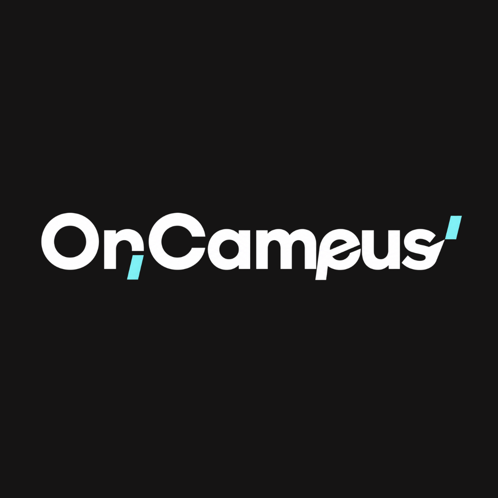

<div align="center">
  
  
  <br />
  <br />

  **The real-time campus social network.**  
  *Find spontaneous hangouts, gaming sessions, and study groups — instantly.*

  <br />

  [](https://nextjs.org/)
  [](https://react.dev/)
  [](https://supabase.com/)
  [](https://www.typescriptlang.org/)
  [](https://tailwindcss.com/)
  [](https://www.framer.com/motion/)
  [](#)
  
  <br />

  [🚀 Live Demo](https://oncampus-web.vercel.app) · [🐛 Report Bug](https://github.com/Yashkush06/OnCampus/issues) · [💡 Request Feature](https://github.com/Yashkush06/OnCampus/issues)

</div>

<br />

---

<br />

## 💡 The Problem

> **"I'm free right now. Who's doing something nearby?"**

College students spend countless hours alone during breaks, scrolling endlessly through social media, while other students just a building away are looking for the exact same thing — someone to hang out with. Traditional social media doesn't solve this because it's not **real-time**, not **hyperlocal**, and not **spontaneous**.

**OnCampus** bridges that gap.

<br />

## ✨ Features

<table>
  <tr>
    <td width="50%">

### 🔥 Live Campus Feed
Real-time scenes happening around campus — sorted by nearest, trending, or starting soon. Never miss what's happening.

### 🎯 Host a Scene
Create events in seconds — *"Free chai at Tapri"*, *"Valorant 5-stack"*, *"DSA Study Group"*. Your campus, your vibe.

### ⚡ Instant Join
One tap to join. No waiting for approvals or awkward requests. Just show up.

### 💬 Live Chat Rooms
Real-time chat with scene attendees. Coordinate, share updates, and hype up the hangout.

   </td>
   <td width="50%">

### 🏷️ Vibe Tags
Discover scenes by mood — `Chill` `Study` `Gaming` `Food` `Sports` `Party` and more.

### 🟢 "I'm Free" Mode
Toggle your availability status. Let the campus know you're down to hang — get matched with scenes and people instantly.

### 👥 Friends & Discovery
Find and add friends across campus. See who's free, who's hosting, and what's popping.

### 🧹 Auto-Cleanup
Scenes auto-archive after they end. The feed stays fresh, the vibes stay spontaneous.

   </td>
  </tr>
</table>

<br />

## 🏗️ Architecture

```
oncampus-web/
├── src/
│   ├── app/                    # Next.js App Router pages
│   │   ├── feed/               # 🔥 Main campus feed
│   │   ├── create/             # ➕ Host a new scene
│   │   ├── room/               # 💬 Live scene chat room
│   │   ├── discover/           # 🔍 Search & explore
│   │   ├── friends/            # 👥 Friend management
│   │   ├── chat/               # 📨 Direct messages
│   │   ├── profile/            # 👤 User profile
│   │   ├── login/              # 🔑 Magic link auth
│   │   ├── onboarding/         # 🎉 New user setup
│   │   └── api/auth/           # 🔐 Auth callbacks
│   ├── components/             # Reusable UI components
│   ├── hooks/                  # Custom React hooks
│   │   ├── useScenes.ts        # Real-time scene subscriptions
│   │   └── useChat.ts          # Live chat functionality
│   ├── lib/                    # Utilities & Supabase clients
│   └── types/                  # TypeScript type definitions
├── supabase/
│   └── migrations/             # Database schema migrations
└── public/                     # Static assets & PWA manifest
```

<br />

## 🛠️ Tech Stack

| Layer | Technology | Purpose |
|-------|-----------|---------|
| **Framework** | Next.js 16 (App Router) | Server components, file-based routing, SSR |
| **UI Library** | React 19 | Latest concurrent features & hooks |
| **Language** | TypeScript 5 | End-to-end type safety |
| **Styling** | Tailwind CSS v4 | Utility-first styling with custom design tokens |
| **Animations** | Framer Motion | Buttery-smooth page transitions & micro-interactions |
| **Backend** | Supabase | PostgreSQL, Realtime subscriptions, Row Level Security |
| **Auth** | Supabase Auth | Magic link (OTP) email authentication |
| **Icons** | Lucide React | Beautiful, consistent icon library |
| **PWA** | next-pwa | Installable app, offline support, push notifications |
| **Deployment** | Vercel | Edge-optimized global CDN |

<br />

## 🎨 Design Philosophy

<div align="center">

*Designed for Gen-Z. Built to feel alive.*

</div>

- **🌑 Dark-First** — Deep blacks (`#0A0A0B`) with neon accent glows — cyan, purple, and pink
- **✨ Glassmorphism** — Frosted-glass card effects with `backdrop-blur` for depth and layering
- **🌊 Micro-Animations** — Every interaction responds with Framer Motion transitions
- **📱 Mobile-Native** — PWA-ready, `100dvh` layouts, no-scrollbar utilities, touch-optimized
- **🔤 Premium Typography** — Inter + Outfit font stack for clean, modern readability
- **💎 Neon Gradients** — Signature cyan-to-purple gradient text and glow effects

<br />

## ⚡ Quick Start

### Prerequisites

- **Node.js** 18+ 
- **npm** or **yarn**
- A [Supabase](https://supabase.com) project

### 1. Clone the repo

```bash
git clone https://github.com/Yashkush06/OnCampus.git
cd OnCampus
```

### 2. Install dependencies

```bash
npm install
```

### 3. Configure environment

Create a `.env.local` file in the project root:

```env
NEXT_PUBLIC_SUPABASE_URL=your_supabase_project_url
NEXT_PUBLIC_SUPABASE_ANON_KEY=your_supabase_anon_key
```

### 4. Run the dev server

```bash
npm run dev
```

Open **[http://localhost:3000](http://localhost:3000)** and you're live. 🎉

<br />

## 🗄️ Database Schema

OnCampus uses **Supabase (PostgreSQL)** with the following core tables:

```sql
profiles         — User identity, avatar, bio, "is_free" status
scenes           — Live events with title, location, vibe_tag, timing
scene_participants — Join table tracking who's in which scene
messages         — Real-time chat within scene rooms
friendships      — Friend connections between users
```

> All tables are secured with **Row Level Security (RLS)** policies for data protection.

<br />

## 🛡️ Safety & Moderation

Built specifically for **safe campus communities**:

- 🔐 **Email-verified accounts** — Magic link authentication, no password phishing
- 🚫 **Report & Block** — Flag inappropriate content or users instantly
- 🔒 **Private Scenes** — Host invite-only hangouts when needed
- 🧹 **Ephemeral Content** — Scenes auto-archive, keeping the feed fresh and safe
- 🛡️ **Row Level Security** — Database-level access control via Supabase RLS

<br />

## 🗺️ Roadmap

- [x] Real-time scene feed with live subscriptions
- [x] Magic link authentication
- [x] Scene creation with vibe tags
- [x] Live chat rooms per scene
- [x] Friend system with requests
- [x] User profiles with "I'm Free" toggle
- [x] PWA support (installable app)
- [ ] Push notifications for nearby scenes
- [ ] Campus heatmap visualization
- [ ] Gamified reputation system (*"Chai King"*, *"Study Demon"*, *"LAN Lord"*)
- [ ] Multi-campus support
- [ ] AI-powered scene recommendations

<br />

## 🤝 Contributing

Contributions are what make the open-source community amazing. Any contributions you make are **greatly appreciated**.

1. Fork the Project
2. Create your Feature Branch (`git checkout -b feature/AmazingFeature`)
3. Commit your Changes (`git commit -m 'Add some AmazingFeature'`)
4. Push to the Branch (`git push origin feature/AmazingFeature`)
5. Open a Pull Request

<br />

## 📄 License

Distributed under the **MIT License**. See `LICENSE` for more information.

<br />

---

<div align="center">
  <br />
  
  <br />
  <br />
  
  **Built with 💙 for college campuses everywhere.**
  
  <br />
  
  <a href="https://github.com/Yashkush06/OnCampus/stargazers">
    
  </a>
  &nbsp;&nbsp;
  <a href="https://github.com/Yashkush06/OnCampus/network/members">
    
  </a>
  
  <br />
  <br />
  
  <sub>If OnCampus helped you, consider giving it a ⭐</sub>
</div>
